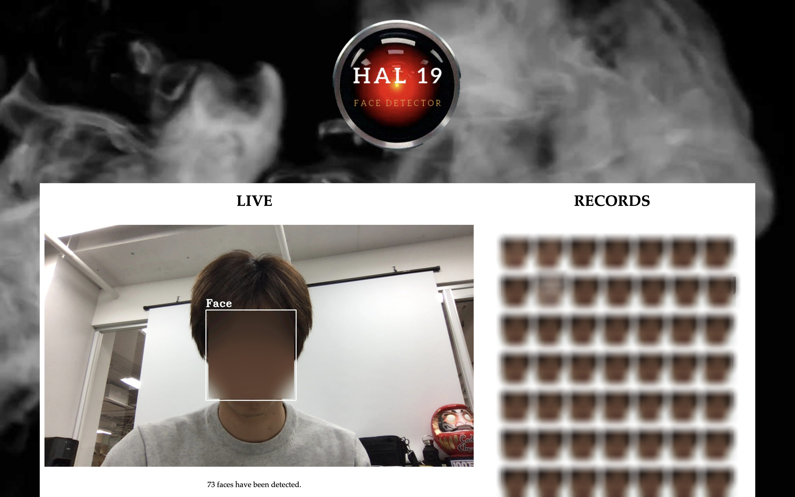

<div align="center">
    
</div>
<h1 align="center" >HAL19</h1>
<h3 align="center">🤖 Face detector from 2019 🤖</h3>
<div align="center">
    <br/>
    <p>Built by 
        <a href="https://github.com/y-yeah">Yuma Sumi</a>
    </p>
    <p><strong>ver 1.0</strong> as of 1 Mar 2019</p>
    <br/>
</div>
<div align="center">
    <div >
        ***********************************************************************
        <p>This was created during my time as a student at <a href="https://codechrysalis.io">Code Chrysalis</a>.</p>
        <br/>
        ***********************************************************************
    </div>
</div>
<br/>
<div align="center">

**HAL19** is the the web application that does 3 things:

1. livestreams a video
2. detects human faces in front of it
3. clips out and displays those images

---

*Also the number of pictures taken gets updated simultaneously below the video, and you can see what time these images are taken by hovering over them.*

---

[Overview](#1-overview)&nbsp;&nbsp;&nbsp; |&nbsp;&nbsp;&nbsp;[Setup](#2-setup)&nbsp;&nbsp;&nbsp;|&nbsp;&nbsp;&nbsp;[Notes](#3-notes)&nbsp;&nbsp;&nbsp;|&nbsp;&nbsp;&nbsp;[Resources](#4-resources)&nbsp;&nbsp;&nbsp;|&nbsp;&nbsp;&nbsp;[Contributions](#5-contributions)

</div>

---

# 1. Overview

This app was built in 4 days to understand how Python works from scratch, during the **Polyglottal week** of CC.




# 2. Setup


## 💡**To use this app on the server**
**_⚠️Currently this app works only at your local. Take a look at [Notes](#3-notes)._**


## 💡**To use this app locally**
## (A) Prerequisites

### 1. Install OpenCV
I highly recommend you to build OpenCV instead of running `pip install opencv-python`. Either way would work, but be aware of the version of Python and pip in your machine.
To manually install OpenCV, I would suggest you to read through [this article](https://www.pyimagesearch.com/2018/08/17/install-opencv-4-on-macos/).

### 2. Install the original repos
Folk the master by clicking **Folk** button and copy the link of the forked repo.
Run the following commands locally:
```
cd <target_repo>
git clone <url_of_your_fork>
```

### 3. Work on the virtual environment
If you have two different versions of Python, make sure that you have created the virtual environment and work on that virtual environment.
```
# the name of your virtual environment can be different.
workon cv
```
Is virtual environment not familiar with you? Take a look at the [official documentation](https://docs.python.org/3/tutorial/venv.html).

### 4. Run Flask and open the server
Flask is going to run a server for you, which is normally at localhost:5000. To do that, run:
```
flask run
```
**_⚠️To run Flask's debugger, run this instead:._**
```
FLASK_env=development flask run
```


To kill the server, push `command + c` in the terminal.

## 3. Notes

* It is **not** safe to keep running this app for long time if your memory and CPU are rather slow. One way to fix this issue is to give HAL19 access to cloud services to store all the pictures it has recorded.
* Training OpenCV by seeding more data sets of human faces and improving accuracy of its face recognition functionality are the keys for HAL19 to keep growing. 

## 4. Resources
These are the very useful to better understand how this app works:
* [Official documentation of Python 3.6](https://docs.python.org/3.6/)
* [Official documentation of OpenCV 4.0.1](https://docs.opencv.org/4.0.1/)
* [Install OpenCV 4 on MacOS](https://www.pyimagesearch.com/2018/08/17/install-opencv-4-on-macos/)

## 5. Contributions

HAL19 wants to improve himself **a lot more**. He needs your help!

Follow the instructions [use this app locally](#2-setup) and you will get the original source on your computer.

To contribute to this app, make sure you create a branch and **ALWAYS** make a pull request. **DO NOT EDIT THE MASTER!**

`git checkout -b <branch_name>`

If you want to push your edited files to your remote file, run the following:

`git push <remote_name> <branch_name>`

---

**LICENSE**: CC7 YUMA SUMI

**Linkedin**: [Yuma Sumi](https://www.linkedin.com/in/yuma-sumi-15b8129a/)

**Twitter**: [@yumayeah](https://twitter.com/yumayeah)
